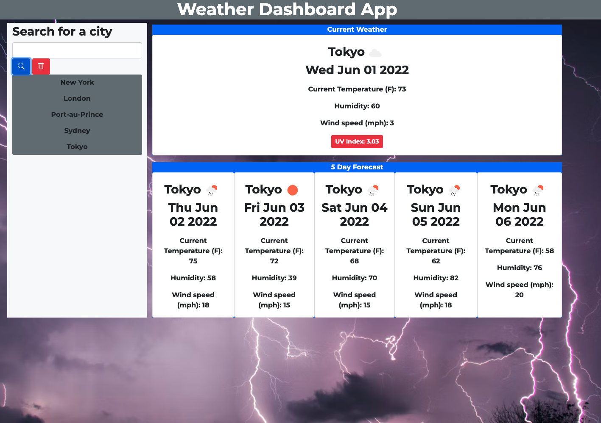

# Weather-Dashboard-App

## Task

I built a weather dashboard that will run in the browser and feature dynamically updated HTML and CSS. This weather dashboard uses an api to retrieve weather data for all cities around the world.

## Description

```
When the user searches for a city they are presented with current and future weather conditions for that city and that city is added to the search history
When the user views current weather conditions for that city they are presented with the city name, the date, an icon representation of weather conditions, the temperature, the humidity, the wind speed, and the UV index
When the user views the UV index they are presented with a color that indicates whether the conditions are favorable, moderate, or severe
When the user views future weather conditions for that city they are presented with a 5-day forecast that displays the date, an icon representation of weather conditions, the temperature, the wind speed, and the humidity
When the user clicks on a city in the search history they are again presented with current and future conditions for that city

```

## Features

```
HTML
CSS (Bootstrap)
JavaScript (jQuery)
OpenWeatherMap (Geocoding API and One Call API 1.0)
Localstorage

```

## Deployed Link
(https://clogerie92.github.io/Weather-Dashboard-App/)


## Mock-Up

The following image shows the web application's appearance and functionality:



## Contributer
Carl Logerie